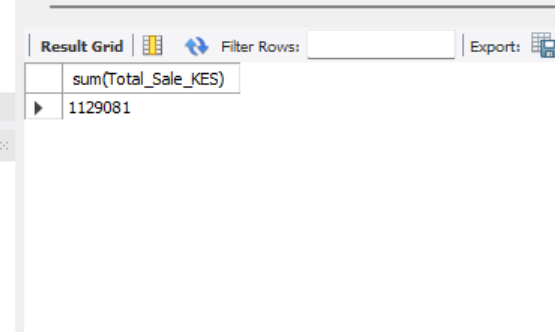
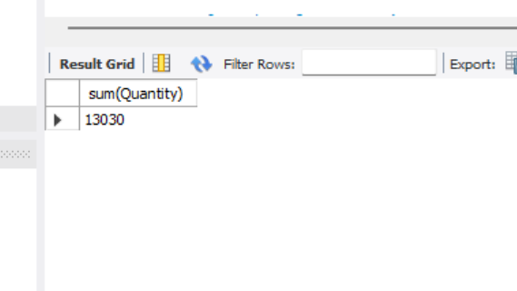
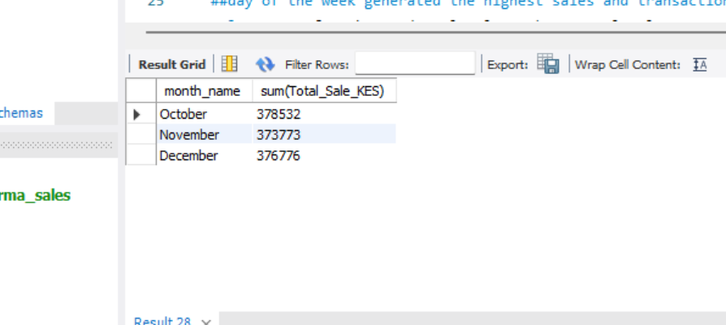
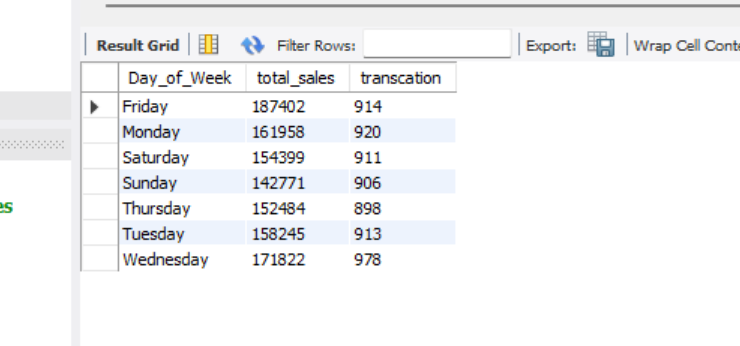
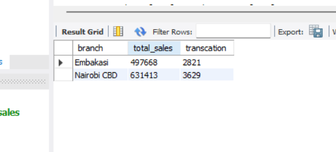
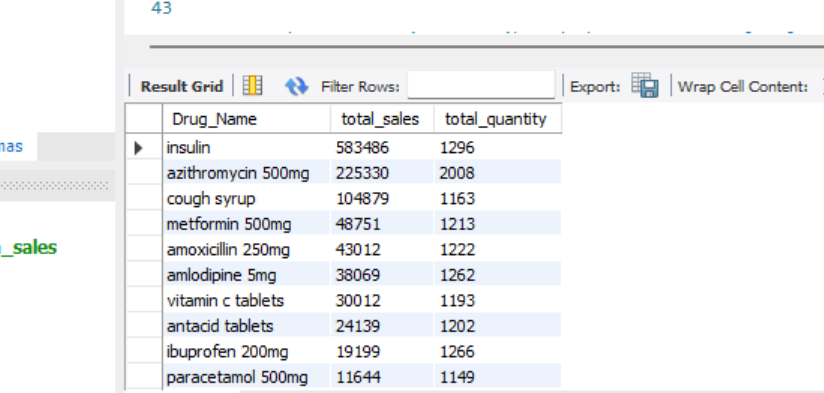
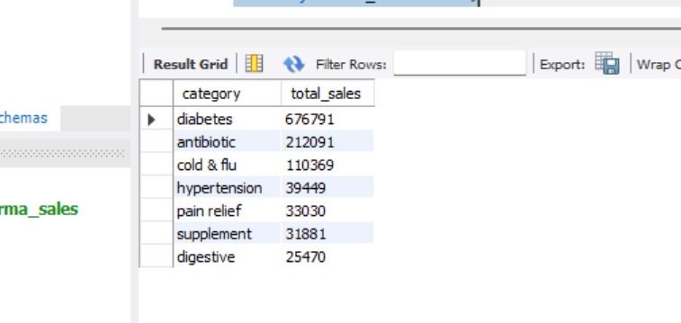
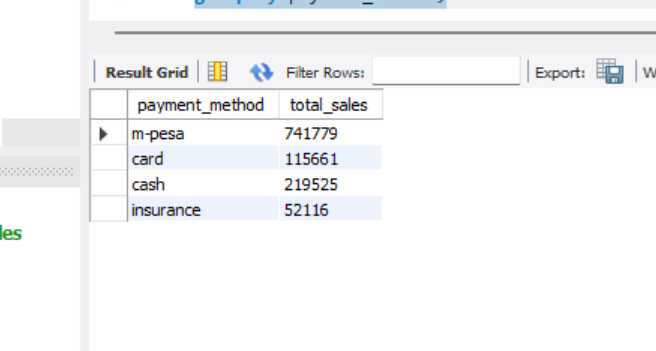

# pharma-sales

## executive summary

## problem statement

Better Health Pharmacy is a chain of pharmacies operating in Nairobi County that provides pharmaceutical products and healthcare supplies to the community.

At the end of Q4 2025, the management requires a clear sales report to evaluate the pharmacy’s performance. However, the sales data has not been properly organized or analyzed, making it difficult to identify sales trends and product performance.

The objective of this project is to analyze the pharmacy’s Q4 2025 sales data and generate meaningful insights about sales performance during the quarter.

The analysis will help stakeholders understand sales trends and support better decision-making in inventory management and sales planning.


---
## dataset
## Dataset Description

The dataset used in this project was synthetically generated to mimic real-world pharmacy sales transactions. The data was created for analytical purposes and does not contain real customer or business information.

It contains sales transaction records from Better Health Pharmacy for Q4 2025. Each row in the dataset represents a single sales transaction made at one of the pharmacy branches. 
The original dataset contains 6697 rows and 12 columns
## Features in the Dataset

| Feature | Description |
|---|---|
| Transaction_ID | A unique identifier assigned to each sales transaction. |
| Date | The date when the transaction was made. |
| Day_of_Week | The day on which the transaction occurred (e.g., Monday, Tuesday). |
| Branch_ID | A unique identifier for each pharmacy branch. |
| Branch_Location | The physical location of the pharmacy branch where the sale occurred. |
| Product_ID | A unique identifier assigned to each product or drug. |
| Drug_Name | The name of the pharmaceutical product sold. |
| Category | The classification of the product, such as antibiotics, painkillers, or vitamins. |
| Quantity | The number of units purchased in the transaction. |
| Unit_Price_KES | The price of a single unit of the product in Kenyan Shillings (KES). |
| Total_Sale_KES | The total sales amount generated from the transaction in Kenyan Shillings (KES). |
| Payment_Method| The method used by the customer to make payment, such as cash, card, or mobile money. |

---

## tools used
1. Python - pandas
2. Looker - visualizations

--- 
## skills demonstated
1. data cleaning
2. 

## project overflow
1. data cleaning
2. 
---

# Data Cleaning Process (Using Pandas)

## 1. Initial Dataset Inspection

The dataset was first inspected to understand its structure and quality.

- Total rows:6,698
- Total columns: 12

This initial step helped identify potential issues such as duplicate records, missing values, incorrect data types, and inconsistent categorical entries.

---

# 2. Duplicate Records

Duplicate rows were checked using the Pandas duplicate detection function.

```python
df.duplicated().sum()
```

- Number of duplicate rows found:152

These duplicate records were removed to ensure each observation in the dataset was unique.

```python
df = df.drop_duplicates()
```

Removing duplicates reduced the risk of biased analysis caused by repeated transactions.

---

# 3. Missing Values Analysis

A check for missing values revealed that the dataset contained **1,002 missing values** distributed across multiple columns.

```python
df.isnull().sum()
```

Instead of applying a single global method, **each column was handled individually** based on its data type and the nature of the data.

---

# 4. Data Type Corrections

Some columns had incorrect data types. For example:

- The **Date column** was originally stored as a string (`object`) and was converted to a proper datetime format.

```python
df['date'] = pd.to_datetime(df['date'])
```

Correct data types are important for accurate analysis and enable time-based operations such as grouping or filtering by date.

---

# 5. Cleaning Text Columns

Categorical text columns (e.g., **day of the week**, **payment method**) were checked for inconsistencies.

To identify inconsistencies, unique values were examined:

```python
df['column_name'].unique()
```

Issues such as spelling variations or formatting differences were found (for example: `"m pesa"` vs `"m-pesa"`).

To standardize the text data:

```python
df['column_name'] = df['column_name'].str.lower().str.strip()
```

This step:

- Converted text to **lowercase**
- Removed **extra spaces**
- Improved consistency across categorical values

---

# 6. Handling Missing Values in Categorical Columns

For categorical columns, missing values were replaced with the **most frequent value (mode)** in the column.

```python
df['column_name'].fillna(df['column_name'].mode()[0], inplace=True)
```

This method preserves the distribution of the data without introducing unrealistic values.

---

# 7. Handling Missing Values in Unit Price

For the **Unit Price** column, missing values were filled by comparing prices of the same drugs.

The prices of similar drugs were analyzed and used to estimate reasonable values for the missing entries.

This approach ensured the filled values remained **consistent with existing drug pricing patterns** in the dataset.

---

# 8. Handling Missing Values in Quantity

For the **Quantity** column, missing values were replaced using the **mean quantity for the respective drug**.

This was done to ensure that imputed values reflected typical purchase quantities.

Example approach:

```python
df['quantity'] = df.groupby('drug')['quantity'].transform(lambda x: x.fillna(x.mean()))
```

Using the mean within each drug group helps maintain realistic transaction patterns.

---

# 9. Final Outcome

After completing the cleaning process:

- Duplicate rows were removed.
- Missing values were handled appropriately depending on the column.
- Data types were corrected.
- Text inconsistencies were standardized.

These steps improved the **accuracy, consistency, and reliability** of the dataset, making it suitable for further analysis and visualization

## analysis using sql
The following SQL queries were used to analyze the sales performance of Better Health Pharmacy for Q4 2025. These queries focus on key business metrics such as total sales, product performance, branch performance, and customer behavior.

---

## 1. Overall Performance (Revenue, Quantity, Transactions)
**insight**:The pharmacy maintained strong health throughout Q4 with over 1.1M KES in revenue,a high transaction count (6,440),  and relative to quantity (13,030) purchase.
###  a) total sales 

```sql
SELECT SUM(Total_Sale_KES)
FROM pharma;
```

### results



### b).Total Quantity Sold

```sql
SELECT SUM(Quantity)
FROM pharma;
```
### results


### c). Total Number of Transactions

```sql
SELECT COUNT(DISTINCT Transaction_ID)
FROM pharma;
```
### results


---
## 2. Sales Trends(monthly and weekly)
Insight: Revenue is incredibly stable across October, November, and December, showing no major seasonal dips. Fridays are your "Money Days" (highest revenue), while Wednesdays are your "Traffic Days" (most transactions).

### a). Sales Trend Over Time

```sql
SELECT MONTHNAME(Date) AS month_name,
SUM(Total_Sale_KES)
FROM pharma
GROUP BY month_name
ORDER BY month_name DESC;
```
### results



### b). Sales by Day of the Week

```sql
SELECT Day_of_Week,
SUM(Total_Sale_KES) AS total_sales,
COUNT(DISTINCT Transaction_ID) AS transaction_count
FROM pharma
GROUP BY Day_of_Week;
```
### results


---

## 3. Branch Performance Analysis
Insight: Nairobi CBD is the primary revenue driver (631,413 ksh), though Embakasi maintains a very healthy transaction volume. This indicates a consistent customer base in both locations, with higher-value baskets likely occurring in the CBD.

```sql
SELECT Branch_Location AS branch,
SUM(Total_Sale_KES) AS total_sales,
COUNT(DISTINCT Transaction_ID) AS transaction_count
FROM pharma
GROUP BY branch;
```
### results


---
## 3. Product & Category Performance
Insight: Management of chronic conditions is the backbone of this pharmacy. Diabetes medications (specifically Insulin) account for more than half of the total revenue. While Antibiotics move the most physical units, their price point is lower than that of chronic care drugs.

### a). Product Performance 

```sql
SELECT Drug_Name,
SUM(Total_Sale_KES) AS total_sales,
SUM(Quantity) AS total_quantity
FROM pharma
GROUP BY Drug_Name
ORDER BY total_sales DESC;
```
### results


### b). Category Performance

```sql
SELECT Category,
SUM(Total_Sale_KES) AS total_sales
FROM pharma
GROUP BY Category
ORDER BY total_sales DESC;
```
### results


---

## 4. Payment Method Analysis
-Pesa handles roughly 65%(741,779 ksh ) of all revenue. Ensuring M-Pesa systems are always up is critical for operational continuity, as it is preferred nearly 3.5x more than cash.

```sql
SELECT Payment_Method,
SUM(Total_Sale_KES) AS total_sales
FROM pharma
GROUP BY Payment_Method;
```
### results


---
## Interactive Performance Dashboard
To see these trends dynamically, I built an interactive data dashboard in Looker Studio. This allows stakeholders to filter the data by branch location and track daily cash flow patterns instantly.
**[Click Here to View the Live Interactive Dashboard](https://datastudio.google.com/reporting/a618b763-e295-4551-9522-9f3943a51b36)**

---
## business recommendations

### **2. Prioritize Diabetes Stock**
-  Never let Insulin or diabetes medicine run out. It brings in over half of your total money, and chronic patients need reliable refills.

### **3. Bulk-Buy Fast Movers**
- Buy **Azithromycin** in larger bulks from suppliers. It is the most popular physical item, so lowering its cost instantly boosts profit margins.

### **4. Optimize Staffing & Stock Delivery**
- Put extra staff on **Wednesdays** to handle the heavy customer crowds and ensure high-value stock is fully replenished before the high-revenue **Friday** rush.

### **5. Grow the Embakasi Branch**
- Launch a small customer loyalty program or local promotion in Embakasi to capture more market share and help it close the minor revenue gap with the CBD branch.

### **6. Encourage Impulse Buying**
- Place inexpensive, high-margin items (like vitamins, painkillers, or band-aids) right at the counter to encourage quick add-on purchases from the  walk-in customers.


